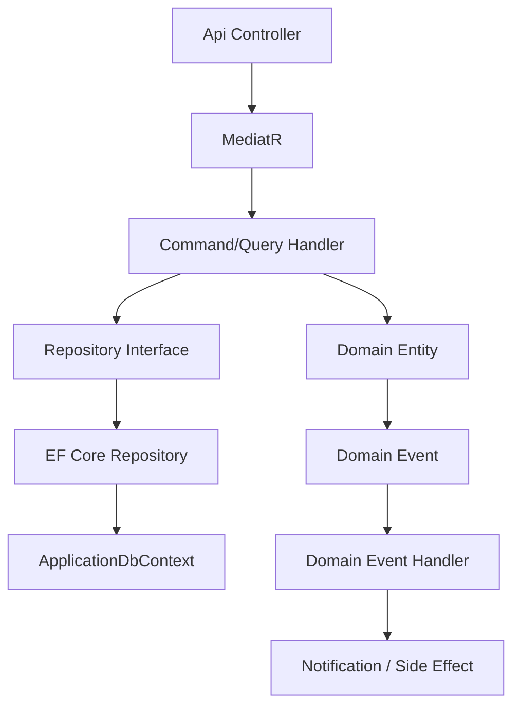
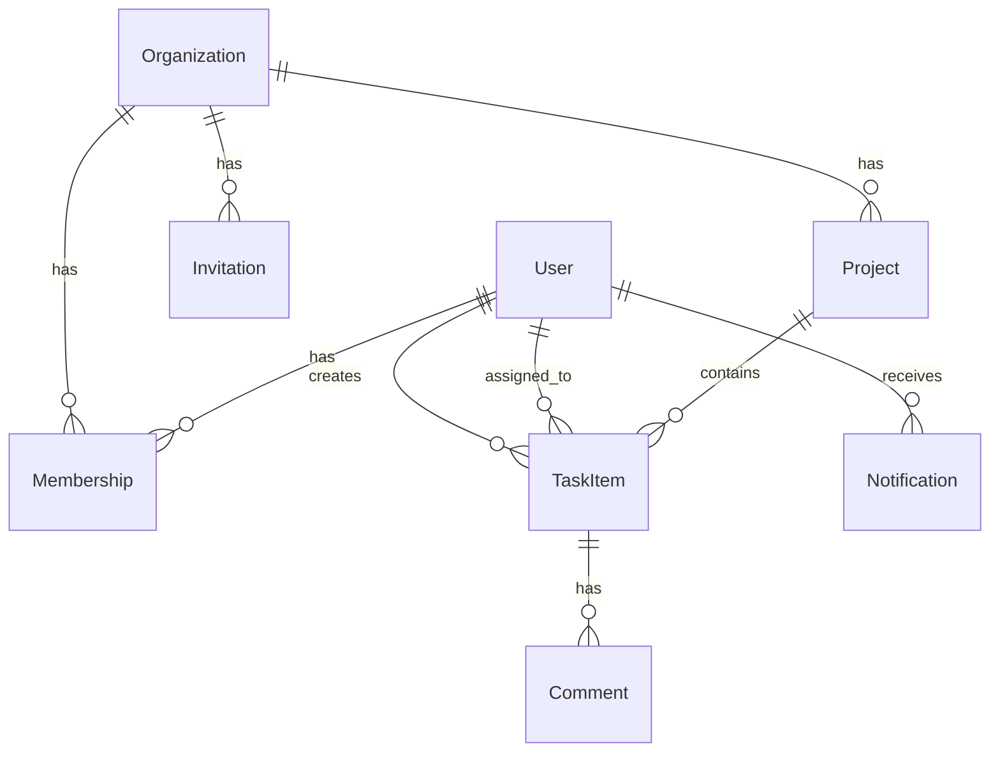

# TaskFlow

**[English](#-english) | [فارسی](#-فارسی)**

---

<br>

# 🇬🇧 English

## Table of Contents

- [Project Title](#project-title)
- [Project Overview](#project-overview)
- [Project Goals](#project-goals)
- [Key Features](#key-features)
- [Technology Stack](#technology-stack)
- [Architecture](#architecture)
- [Project Structure](#project-structure)
- [Domain Model](#domain-model)
- [Design Decisions](#design-decisions)
- [Multi-Tenancy](#multi-tenancy)
- [Authentication & Authorization](#authentication--authorization)
- [API Overview](#api-overview)
- [Engineering Practices](#engineering-practices)
- [Getting Started](#getting-started)
- [Running Tests](#running-tests)
- [Roadmap](#roadmap)
- [Contributing](#contributing)
- [License](#license)
- [Contact](#contact)

---

## Project Title

**TaskFlow** — A multi-tenant task and project management backend API built with ASP.NET Core and Clean Architecture.

---

## Project Overview

TaskFlow is a backend API that enables teams to manage organizations, projects, tasks, comments, and notifications in a multi-tenant environment.

It was built as a portfolio project to demonstrate production-oriented backend engineering practices expected from a Junior/Mid-Level .NET developer: Clean Architecture, Domain-Driven Design principles, CQRS, proper authentication/authorization, multi-tenancy, and background processing.

The main business problem it solves is providing a structured, tenant-isolated way for organizations to organize work (projects → tasks → comments) while supporting role-based access, invitations, and event-driven notifications.

---

## Project Goals

- Production-quality backend structure using Clean Architecture
- Rich domain model with Value Objects and explicit business rules
- CQRS via MediatR
- Multi-tenancy with data isolation
- Maintainable and testable codebase
- Clear separation of concerns and dependency inversion
- Secure authentication and fine-grained authorization

---

## Key Features

### Authentication
- User registration
- Login with JWT access token
- Refresh token rotation with family tracking and reuse detection
- Logout (refresh token revocation)

### Organizations
- Create organization (creator becomes Owner)
- Update organization name
- Archive organization
- Get organization by ID

### Membership & Invitations
- Invite users by email with role and expiration
- Accept invitation (token-based)
- Cancel pending invitation
- Change member role
- Suspend / Activate member
- Remove member
- Leave organization
- Transfer ownership

### Projects
- Create project
- Update project (name, description)
- Archive project
- Search projects (keyword, archived status, pagination, sorting)
- Get project by ID

### Tasks
- Create task (with priority, due date, optional assignee)
- Update task
- Archive task
- Assign / Unassign user
- Change status (Todo → InProgress → Done → Cancelled)
- Search tasks (project, keyword, status, priority, assignee, due date range, archived, pagination, sorting)
- Get task by ID

### Comments
- Create comment on a task
- Update comment
- Archive comment
- Get comments by task
- Search comments (keyword, author, date range, pagination, sorting)
- Get comment by ID

### Notifications
- List notifications (filter by read status, pagination)
- Unread count
- Mark single notification as read
- Mark all as read
- Generated via domain events (TaskAssigned, TaskCompleted, CommentCreated, ProjectArchived, MembershipAdded)

### Background Jobs (Hangfire)
- Recurring cleanup of expired invitations
- Recurring cleanup of old notifications
- Task reminder scheduling support

---

## Technology Stack

| Category              | Technology                          |
|-----------------------|-------------------------------------|
| Framework             | .NET 8, ASP.NET Core                |
| Architecture          | Clean Architecture + CQRS           |
| ORM                   | Entity Framework Core 8             |
| Database              | SQL Server                          |
| Messaging             | MediatR 12                          |
| Validation            | FluentValidation                    |
| Authentication        | ASP.NET Core Identity + JWT Bearer  |
| Authorization         | Policy-based (custom requirements)  |
| Multi-tenancy         | Global Query Filters + Tenant Middleware |
| Background Jobs       | Hangfire (SQL Server storage)       |
| Logging               | Serilog (referenced)                |
| API Documentation     | Swagger / Swashbuckle               |
| Testing               | xUnit, Moq, FluentAssertions        |
| Result Pattern        | Custom `Result<T>` / `BaseResult`   |

---

## Architecture

The solution follows **Clean Architecture** with a clear dependency rule: outer layers depend on inner layers, never the reverse.

```
┌─────────────────────────────────────────┐
│              TaskFlow.Api               │  ← Controllers, Middleware, Contracts
├─────────────────────────────────────────┤
│          TaskFlow.Infrastructure        │  ← EF Core, Identity, JWT, Hangfire, Repositories
├─────────────────────────────────────────┤
│           TaskFlow.Application          │  ← Commands, Queries, Handlers, Validators, Abstractions
├─────────────────────────────────────────┤
│             TaskFlow.Domain             │  ← Entities, Value Objects, Enums, Domain Events, Errors
└─────────────────────────────────────────┘
```

### Layer Responsibilities

| Layer              | Responsibility                                                              |
|--------------------|-----------------------------------------------------------------------------|
| **Domain**         | Entities, Value Objects, domain events, business rules, Result pattern      |
| **Application**    | Use cases (Commands/Queries), validation, interfaces, domain event handlers |
| **Infrastructure** | Persistence, Identity, JWT, Hangfire, email, multi-tenancy implementations  |
| **Api**            | HTTP endpoints, request/response contracts, middleware, authorization policies |

### Dependency Rule
Domain has no dependencies. Application depends only on Domain. Infrastructure and Api depend on Application (and Domain where needed).

### CQRS
- Commands implement `ICommand` / `ICommand<T>`
- Queries implement `IQuery<T>`
- Handlers are thin and orchestrate domain + persistence
- MediatR pipeline includes FluentValidation behavior

### Rich Domain Model
Entities encapsulate state changes and invariants. Operations return `Result` / `BaseResult` instead of throwing. Domain events are raised from within the domain and dispatched after successful persistence.



---

## Project Structure

```
TaskFlow/
├── TaskFlow.Api/                  # ASP.NET Core Web API
│   ├── Controllers/
│   ├── Contracts/                 # Request/Response DTOs
│   ├── Middleware/                # Exception handling, Tenant
│   └── Extensions/
├── TaskFlow.Application/          # Application layer
│   ├── Abstractions/              # Interfaces (Persistence, Auth, MultiTenancy, etc.)
│   ├── Authentication/
│   ├── Organizations/
│   ├── Projects/
│   ├── Tasks/
│   ├── Comments/
│   ├── Notifications/
│   ├── Events/Handlers/
│   └── Behaviors/                 # ValidationBehavior
├── TaskFlow.Domain/               # Domain layer
│   ├── Entities/
│   ├── ValueObjects/
│   ├── Enums/
│   ├── Events/
│   ├── Errors/
│   └── Common/                    # Result, BaseEntity, AuditableEntity, ITenantEntity
├── TaskFlow.Infrastructure/       # Infrastructure layer
│   ├── Persistence/               # DbContext, Configurations, Repositories, Migrations
│   ├── Identity/
│   ├── Authentication/
│   ├── Authorization/
│   ├── MultiTenancy/
│   ├── BackgroundJobs/
│   └── Services/
└── TaskFlow.UnitTests/            # Unit tests (Domain + selected Application handlers)
```

---

## Domain Model

### Main Aggregates / Entities

| Entity           | Key Concepts                                                                  |
|------------------|-------------------------------------------------------------------------------|
| **User**         | Email, DisplayName, IsActive                                                  |
| **Organization** | Name, Memberships, Projects, Archive                                          |
| **Membership**   | User + Organization, Role (Member/Admin/Owner/ProjectManager), Status         |
| **Invitation**   | Email, Role, Token, Expiration, Status (Pending/Accepted/Expired/Cancelled)   |
| **Project**      | Name, Description, Organization, Archive                                      |
| **TaskItem**     | Title, Description, Status, Priority, DueDate, Assignee, Creator, Archive     |
| **Comment**      | Content, Task, Author, Archive                                                |
| **Notification** | Type, Title, Message, RelatedEntity, IsRead                                   |

### Relationships (simplified)



Value Objects used: `Email`, `DisplayName`, `OrganizationName`, `ProjectName`, `ProjectDescription`, `TaskItemTitle`, `TaskItemDescription`, `CommentContent`, `InvitationToken`.

---

## Design Decisions

| Decision                      | Rationale (based on implementation) |
|-------------------------------|-------------------------------------|
| **Clean Architecture**        | Clear separation, testability, and independence from infrastructure details |
| **CQRS + MediatR**            | Separates read and write models; enables pipeline behaviors (validation) |
| **Result Pattern**            | Explicit success/failure without exceptions for expected domain/validation errors |
| **Rich Domain Model**         | Business rules live in entities (e.g. cannot remove Owner, cannot archive twice) |
| **Value Objects**             | Encapsulate validation and equality for Email, Names, Tokens, etc. |
| **Repository + Unit of Work** | Abstracts persistence; `IUnitOfWork` coordinates SaveChanges and domain event dispatch |
| **Global Query Filters**      | Automatic tenant isolation for all `ITenantEntity` types |
| **Domain Events**             | Decouples side effects (notifications) from core use cases |
| **Refresh Token Families**    | Detects token reuse and revokes the entire family on breach |

---

## Multi-Tenancy

- **Tenant Resolution**: After authentication, `ITenantResolver` resolves the user's organization from membership.
- **Tenant Context**: `ICurrentTenant` holds the current `OrganizationId`.
- **Initialization**: `TenantMiddleware` calls `ITenantContextInitializer` on each request.
- **Isolation**: EF Core global query filters on all `ITenantEntity` implementations (`Project`, `TaskItem`, `Comment`, `Membership`, `Invitation`, `Notification`, etc.). Filters are bypassed only where explicitly needed (e.g. invitation token lookup).
- **Authorization**: Policies (`OrganizationMember`, `OrganizationAdmin`, `ProjectManager`) enforce role checks within the tenant.

---

## Authentication & Authorization

### Authentication
- ASP.NET Core Identity for password hashing and user store (`ApplicationUser`)
- Domain `User` entity kept separate from Identity
- JWT Bearer tokens (configurable issuer, audience, key, expiry)
- Refresh tokens stored in database with family ID, expiration, and revocation support
- Token reuse detection revokes the entire family

### Authorization Policies

| Policy                 | Requirement                          |
|------------------------|--------------------------------------|
| `OrganizationMember`   | Active membership in current tenant  |
| `OrganizationAdmin`    | Admin or Owner role                  |
| `ProjectManager`       | ProjectManager, Admin, or Owner role |

Policies are enforced at the controller/action level.

---

## API Overview

All endpoints (except authentication and invitation acceptance) require a valid JWT.

### Base path: `/api`

### Authentication
| Method | Endpoint | Auth | Description |
|--------|----------|------|-------------|
| POST | `/authentication/register` | Anonymous | Register new user |
| POST | `/authentication/login` | Anonymous | Login, returns access + refresh token |
| POST | `/authentication/refresh-token` | Anonymous | Rotate refresh token |
| POST | `/authentication/logout` | Authenticated | Revoke refresh token |

### Organizations
| Method | Endpoint | Policy | Description |
|--------|----------|--------|-------------|
| GET | `/organizations/{id}` | Authenticated | Get organization by ID |
| POST | `/organizations` | Authenticated | Create organization |
| PUT | `/organizations/{id}` | OrganizationAdmin | Update name |
| PATCH | `/organizations/{id}/archive` | OrganizationAdmin | Archive organization |

### Invitations
| Method | Endpoint | Policy | Description |
|--------|----------|--------|-------------|
| POST | `/organizations/{orgId}/invitations` | OrganizationAdmin | Invite user |
| POST | `/organizations/invitations/accept` | Anonymous | Accept invitation by token |
| DELETE | `/organizations/{orgId}/invitations/{id}` | OrganizationAdmin | Cancel invitation |
| GET | `/organizations/invitations/{token}` | Anonymous | Get invitation details |
| GET | `/organizations/{orgId}/invitations` | OrganizationAdmin | List invitations (paged) |

### Membership
| Method | Endpoint | Policy | Description |
|--------|----------|--------|-------------|
| DELETE | `/organizations/{orgId}/members/{userId}` | OrganizationAdmin | Remove member |
| POST | `/organizations/{orgId}/members/leave` | Authenticated | Leave organization |
| PUT | `/organizations/{orgId}/members/{userId}/role` | OrganizationAdmin | Change role |
| PUT | `/organizations/{orgId}/members/{userId}/suspend` | OrganizationAdmin | Suspend member |
| PUT | `/organizations/{orgId}/members/{userId}/activate` | OrganizationAdmin | Activate member |
| PUT | `/organizations/{orgId}/members/{userId}/transfer-ownership` | OrganizationAdmin | Transfer ownership |

### Projects
| Method | Endpoint | Policy | Description |
|--------|----------|--------|-------------|
| GET | `/projects` | OrganizationMember | Search projects |
| GET | `/projects/{id}` | OrganizationMember | Get project by ID |
| POST | `/projects` | OrganizationMember | Create project |
| PUT | `/projects/{id}` | OrganizationAdmin | Update project |
| PATCH | `/projects/{id}/archive` | OrganizationAdmin | Archive project |

### Tasks
| Method | Endpoint | Policy | Description |
|--------|----------|--------|-------------|
| GET | `/tasks` | OrganizationMember | Search tasks (filters, paging, sort) |
| GET | `/tasks/{id}` | OrganizationMember | Get task by ID |
| POST | `/tasks` | ProjectManager | Create task |
| PUT | `/tasks/{id}` | ProjectManager | Update task |
| PATCH | `/tasks/{id}/archive` | ProjectManager | Archive task |
| PATCH | `/tasks/{id}/assign` | ProjectManager | Assign user |
| PATCH | `/tasks/{id}/unassign` | ProjectManager | Unassign user |
| PATCH | `/tasks/{id}/status` | ProjectManager | Change status |

### Comments
| Method | Endpoint | Policy | Description |
|--------|----------|--------|-------------|
| GET | `/comments` | OrganizationMember | List comments (query) |
| POST | `/comments` | OrganizationMember | Add comment to task |

### Notifications
| Method | Endpoint | Policy | Description |
|--------|----------|--------|-------------|
| GET | `/notifications` | OrganizationMember | List user notifications |
| PATCH | `/notifications/{id}/read` | OrganizationMember | Mark as read |

Swagger UI is available in Development at `/swagger`.

---

## Engineering Practices

- SOLID principles (especially Dependency Inversion and Single Responsibility)
- Dependency Injection throughout
- FluentValidation with MediatR pipeline behavior
- Result pattern for explicit error handling
- Repository pattern + Unit of Work
- Domain events with post-persistence dispatch
- Global exception handling middleware (Problem Details style)
- Policy-based authorization
- Global query filters for multi-tenancy
- Soft archive instead of hard deletes on key entities
- Unit tests covering domain entities, value objects, Result, and selected command handlers

---

## Getting Started

### Prerequisites
- .NET 8 SDK
- SQL Server (LocalDB or full instance)

### Steps

1. **Clone the repository**
   ```bash
   git clone <repository-url>
   cd TaskFlow
   ```

2. **Configure connection string**  
   Edit `TaskFlow.Api/appsettings.Development.json`:
   ```json
   "ConnectionStrings": {
     "DefaultConnection": "Server=.;Database=TaskFlowDb;Trusted_Connection=True;TrustServerCertificate=True;MultipleActiveResultSets=true;"
   }
   ```

3. **Configure JWT**  
   Ensure a sufficiently long secret key is set under the `Jwt` / `Authentication:Jwt` section.

4. **Restore packages**
   ```bash
   dotnet restore
   ```

5. **Apply migrations**
   ```bash
   cd TaskFlow.Api
   dotnet ef database update --project ../TaskFlow.Infrastructure
   ```

6. **Run the API**
   ```bash
   dotnet run --project TaskFlow.Api
   ```

7. Open Swagger at `https://localhost:<port>/swagger` (or the HTTP port shown in the console).

Hangfire Dashboard is available at `/hangfire` (protected by `OrganizationAdmin` policy).

---

## Running Tests

```bash
dotnet test TaskFlow.UnitTests
```

The test project currently covers:
- Domain entities (Organization, Project, TaskItem, Membership, User)
- Value Objects
- Result / Error
- Domain Events
- CreateOrganization command handler and validator

---

## Roadmap

Potential future improvements visible from the current structure (not yet implemented):
- Integration / end-to-end tests
- Full email delivery for invitations (currently partially stubbed when SMTP is not configured)
- More comprehensive application-layer unit tests
- Soft-delete / restore flows beyond archive
- Real-time notifications (SignalR)
- API versioning
- Rate limiting / API throttling
- OpenTelemetry / structured logging (Serilog + Seq)
- Project-level permissions (ProjectManager policy refinement)
- File attachments on tasks/comments
- SignalR real-time notifications
- Docker Compose for local dev (SQL Server + API)
- CI/CD pipeline (GitHub Actions)

---

## License

This project is licensed under the MIT License. See [LICENSE](LICENSE) for details.

---

<br><br>

---

<br>

<div dir="rtl" markdown="1">

# 🇮🇷 فارسی

## فهرست مطالب

- [عنوان پروژه](#عنوان-پروژه)
- [نمای کلی پروژه](#نمای-کلی-پروژه)
- [اهداف پروژه](#اهداف-پروژه)
- [ویژگی‌های کلیدی](#ویژگی‌های-کلیدی)
- [پشته فناوری](#پشته-فناوری)
- [معماری](#معماری)
- [ساختار پروژه](#ساختار-پروژه)
- [مدل دامنه](#مدل-دامنه)
- [تصمیمات طراحی](#تصمیمات-طراحی)
- [چندمستأجری (Multi-Tenancy)](#چندمستأجری-multi-tenancy)
- [احراز هویت و مجوزدهی](#احراز-هویت-و-مجوزدهی)
- [نمای کلی API](#نمای-کلی-api)
- [شیوه‌های مهندسی](#شیوه‌های-مهندسی)
- [راه‌اندازی پروژه](#راه‌اندازی-پروژه)
- [اجرای تست‌ها](#اجرای-تست‌ها)
- [نقشه راه](#نقشه-راه)
- [مشارکت در پروژه](#مشارکت-در-پروژه)
- [مجوز](#مجوز)
- [تماس](#تماس)

---

## عنوان پروژه

**TaskFlow** — بک‌اند مدیریت پروژه و تسک با پشتیبانی از چندمستأجری، مبتنی بر ASP.NET Core و Clean Architecture.

---

## نمای کلی پروژه

TaskFlow یک API بک‌اند است که به تیم‌ها اجازه می‌دهد سازمان‌ها، پروژه‌ها، تسک‌ها، کامنت‌ها و اعلان‌ها را در محیطی چندمستأجری مدیریت کنند.

این پروژه به‌عنوان نمونه‌کار (Portfolio) طراحی شده تا نشان دهد یک توسعه‌دهنده جونیور یا میدل دات‌نت چگونه می‌تواند بک‌اندی با ساختار production-ready بسازد؛ از Clean Architecture و اصول Domain-Driven Design گرفته تا CQRS، احراز هویت و مجوزدهی درست، جداسازی داده بین مستأجرها و پردازش کارهای پس‌زمینه.

هدف اصلی این است که سازمان‌ها بتوانند کارهایشان را به‌صورت ساختاریافته (پروژه ← تسک ← کامنت) سازمان‌دهی کنند، در حالی که دسترسی بر اساس نقش، سیستم دعوت‌نامه و اعلان‌های رویدادمحور هم پشتیبانی شود.

---

## اهداف پروژه

- ساخت بک‌اند با کیفیت production و ساختار Clean Architecture
- مدل دامنه غنی همراه با Value Objects و قوانین کسب‌وکار مشخص
- پیاده‌سازی CQRS با MediatR
- پشتیبانی از مدل چندمستأجری همراه با جداسازی واقعی داده‌ها
- کدبیس قابل نگهداری و تست‌پذیر
- جداسازی شفاف مسئولیت‌ها و رعایت Dependency Inversion
- احراز هویت امن و مجوزدهی دقیق بر اساس نقش

---

## ویژگی‌های کلیدی

### احراز هویت
- ثبت‌نام کاربر
- ورود و دریافت JWT Access Token
- چرخش Refresh Token با ردیابی خانواده توکن و تشخیص استفاده مجدد (Token Reuse Detection)
- خروج و باطل‌کردن Refresh Token

### سازمان‌ها
- ایجاد سازمان (ایجادکننده به‌طور خودکار Owner می‌شود)
- ویرایش نام سازمان
- آرشیو کردن سازمان
- دریافت اطلاعات سازمان با شناسه

### عضویت و دعوت‌نامه
- دعوت کاربر با ایمیل، نقش و مدت اعتبار
- پذیرش دعوت‌نامه از طریق توکن
- لغو دعوت‌نامه در انتظار
- تغییر نقش عضو
- تعلیق و فعال‌سازی مجدد عضو
- حذف عضو
- ترک سازمان
- انتقال مالکیت

### پروژه‌ها
- ایجاد پروژه
- ویرایش نام و توضیحات
- آرشیو پروژه
- جستجو (کلمه کلیدی، وضعیت آرشیو، صفحه‌بندی و مرتب‌سازی)
- دریافت پروژه با شناسه

### تسک‌ها
- ایجاد تسک (اولویت، تاریخ سررسید و انتساب اختیاری)
- ویرایش تسک
- آرشیو تسک
- انتساب و لغو انتساب کاربر
- تغییر وضعیت (Todo → InProgress → Done → Cancelled)
- جستجوی پیشرفته (پروژه، کلمه کلیدی، وضعیت، اولویت، مسئول، بازه تاریخ سررسید، آرشیو، صفحه‌بندی و مرتب‌سازی)
- دریافت تسک با شناسه

### کامنت‌ها
- ثبت کامنت روی تسک
- ویرایش کامنت
- آرشیو کامنت
- دریافت لیست کامنت‌های یک تسک
- جستجو (کلمه کلیدی، نویسنده، بازه زمانی، صفحه‌بندی و مرتب‌سازی)
- دریافت کامنت با شناسه

### اعلان‌ها (Notifications)
- لیست اعلان‌ها با فیلتر وضعیت خوانده‌شده و صفحه‌بندی
- تعداد اعلان‌های خوانده‌نشده
- علامت‌زدن یک اعلان به‌عنوان خوانده‌شده
- علامت‌زدن همه اعلان‌ها به‌عنوان خوانده‌شده
- تولید خودکار از طریق Domain Event (انتساب تسک، تکمیل تسک، ثبت کامنت، آرشیو پروژه، اضافه‌شدن عضو)

### کارهای پس‌زمینه (Hangfire)
- پاک‌سازی دوره‌ای دعوت‌نامه‌های منقضی‌شده
- پاک‌سازی اعلان‌های قدیمی
- پشتیبانی از زمان‌بندی یادآوری تسک

---

## پشته فناوری

<div dir="ltr">

| Category | Technology |
|----------|------------|
| Framework | .NET 8, ASP.NET Core |
| Architecture | Clean Architecture + CQRS |
| ORM | Entity Framework Core 8 |
| Database | SQL Server |
| Messaging | MediatR 12 |
| Validation | FluentValidation |
| Authentication | ASP.NET Core Identity + JWT Bearer |
| Authorization | Policy-based (custom requirements) |
| Multi-tenancy | Global Query Filters + Tenant Middleware |
| Background Jobs | Hangfire (SQL Server storage) |
| Logging | Serilog (referenced) |
| API Documentation | Swagger / Swashbuckle |
| Testing | xUnit, Moq, FluentAssertions |
| Result Pattern | Custom `Result<T>` / `BaseResult` |

</div>

---

## معماری

پروژه بر اساس **Clean Architecture** طراحی شده و قانون وابستگی در آن رعایت شده: لایه‌های بیرونی به لایه‌های درونی وابسته‌اند، نه برعکس.

<div dir="ltr">

```
┌─────────────────────────────────────────┐
│              TaskFlow.Api               │  ← Controllers, Middleware, Contracts
├─────────────────────────────────────────┤
│          TaskFlow.Infrastructure        │  ← EF Core, Identity, JWT, Hangfire, Repositories
├─────────────────────────────────────────┤
│           TaskFlow.Application          │  ← Commands, Queries, Handlers, Validators, Abstractions
├─────────────────────────────────────────┤
│             TaskFlow.Domain             │  ← Entities, Value Objects, Enums, Domain Events, Errors
└─────────────────────────────────────────┘
```

</div>

### مسئولیت هر لایه

<div dir="ltr">

| Layer | Responsibility |
|-------|----------------|
| **Domain** | Entities, Value Objects, Domain Events, business rules, Result pattern |
| **Application** | Use Cases (Commands / Queries), validation, interfaces, Domain Event handlers |
| **Infrastructure** | Persistence, Identity, JWT, Hangfire, email, multi-tenancy implementations |
| **Api** | HTTP endpoints, request/response contracts, middleware, authorization policies |

</div>

### قانون وابستگی
لایه Domain هیچ وابستگی خارجی ندارد. Application فقط به Domain وابسته است. Infrastructure و Api به Application (و در صورت نیاز به Domain) وابسته‌اند.

### CQRS
- هر Command اینترفیس `ICommand` یا `ICommand<T>` را پیاده‌سازی می‌کند.
- هر Query اینترفیس `IQuery<T>` را پیاده‌سازی می‌کند.
- Handlers به‌صورت نازک نگه داشته شده‌اند و فقط هماهنگی بین دامنه و لایه Persistence را انجام می‌دهند.
- در پایپ‌لاین MediatR، رفتار اعتبارسنجی FluentValidation ثبت شده است.

### مدل دامنه غنی
هر Entity تغییر وضعیت و قیدهای کسب‌وکار (Invariant) را خودش مدیریت می‌کند. به‌جای پرتاب Exception برای خطاهای قابل‌پیش‌بینی، عملیات‌ها `Result` یا `BaseResult` برمی‌گردانند. Domain Events از داخل دامنه صادر می‌شوند و بعد از ذخیره موفق در دیتابیس، dispatch می‌شوند.

<div dir="ltr">


</div>

---

## ساختار پروژه

<div dir="ltr">

```
TaskFlow/
├── TaskFlow.Api/                  # ASP.NET Core Web API
│   ├── Controllers/
│   ├── Contracts/                 # Request / Response DTOs
│   ├── Middleware/                # Exception handling, Tenant
│   └── Extensions/
├── TaskFlow.Application/          # Application layer
│   ├── Abstractions/              # Interfaces (Persistence, Auth, MultiTenancy, ...)
│   ├── Authentication/
│   ├── Organizations/
│   ├── Projects/
│   ├── Tasks/
│   ├── Comments/
│   ├── Notifications/
│   ├── Events/Handlers/
│   └── Behaviors/                 # ValidationBehavior
├── TaskFlow.Domain/               # Domain layer
│   ├── Entities/
│   ├── ValueObjects/
│   ├── Enums/
│   ├── Events/
│   ├── Errors/
│   └── Common/                    # Result, BaseEntity, AuditableEntity, ITenantEntity
├── TaskFlow.Infrastructure/       # Infrastructure layer
│   ├── Persistence/               # DbContext, Configurations, Repositories, Migrations
│   ├── Identity/
│   ├── Authentication/
│   ├── Authorization/
│   ├── MultiTenancy/
│   ├── BackgroundJobs/
│   └── Services/
└── TaskFlow.UnitTests/            # Unit tests (Domain + selected Application handlers)
```

</div>

---

## مدل دامنه

### موجودیت‌های اصلی

<div dir="ltr">

| Entity | Key concepts |
|--------|--------------|
| **User** | Email, DisplayName, IsActive |
| **Organization** | Name, Memberships, Projects, Archive |
| **Membership** | User + Organization, Role (Member / Admin / Owner / ProjectManager), Status |
| **Invitation** | Email, Role, Token, Expiration, Status (Pending / Accepted / Expired / Cancelled) |
| **Project** | Name, Description, Organization, Archive |
| **TaskItem** | Title, Description, Status, Priority, DueDate, Assignee, Creator, Archive |
| **Comment** | Content, Task, Author, Archive |
| **Notification** | Type, Title, Message, RelatedEntity, IsRead |

</div>

### روابط (به‌صورت خلاصه)

<div dir="ltr">


</div>

Value Objects تعریف‌شده: `Email`، `DisplayName`، `OrganizationName`، `ProjectName`، `ProjectDescription`، `TaskItemTitle`، `TaskItemDescription`، `CommentContent` و `InvitationToken`.

---

## تصمیمات طراحی

<div dir="ltr">

| Decision | Rationale (based on actual implementation) |
|----------|--------------------------------------------|
| **Clean Architecture** | Clear layer separation, better testability, independence from infrastructure details |
| **CQRS + MediatR** | Separates read and write models; enables pipeline behaviors (e.g. validation) |
| **Result Pattern** | Explicit success/failure without exceptions for expected domain and validation errors |
| **Rich Domain Model** | Business rules live inside entities (e.g. Owner cannot be removed, entity cannot be archived twice) |
| **Value Objects** | Encapsulate validation and equality for concepts like Email, Name, Token |
| **Repository + Unit of Work** | Abstracts persistence; `IUnitOfWork` coordinates SaveChanges and domain event dispatch |
| **Global Query Filters** | Automatic tenant isolation for all types implementing `ITenantEntity` |
| **Domain Events** | Decouples side effects (e.g. notifications) from core use cases |
| **Refresh Token Families** | Detects token reuse and revokes the entire family on breach |

</div>

---

## چندمستأجری (Multi-Tenancy)

- **تشخیص مستأجر**: بعد از احراز هویت، `ITenantResolver` سازمان کاربر را از روی Membership پیدا می‌کند.
- **Context مستأجر**: `ICurrentTenant` شناسه سازمان فعلی (`OrganizationId`) را نگه می‌دارد.
- **مقداردهی اولیه**: `TenantMiddleware` در هر درخواست، `ITenantContextInitializer` را فراخوانی می‌کند.
- **جداسازی داده**: روی تمام Entity هایی که `ITenantEntity` را پیاده‌سازی کرده‌اند (`Project`, `TaskItem`, `Comment`, `Membership`, `Invitation`, `Notification` و ...) فیلتر سراسری EF Core اعمال شده است. این فیلتر فقط در موارد خاص (مثل جستجوی دعوت‌نامه با توکن) نادیده گرفته می‌شود.
- **مجوزدهی**: Policyهایی مثل `OrganizationMember`، `OrganizationAdmin` و `ProjectManager` نقش کاربر را داخل همان مستأجر بررسی می‌کنند.

---

## احراز هویت و مجوزدهی

### احراز هویت
- از ASP.NET Core Identity برای هش رمز عبور و نگهداری کاربر (`ApplicationUser`) استفاده شده است.
- Entity دامنه `User` جدا از Identity نگه داشته شده تا وابستگی دامنه به زیرساخت کم شود.
- Access Token از نوع JWT Bearer است (Issuer، Audience، Key و مدت اعتبار قابل پیکربندی).
- Refresh Tokens در دیتابیس با Family ID، تاریخ انقضا و قابلیت ابطال ذخیره می‌شوند.
- در صورت تشخیص استفاده مجدد از یک توکن، کل خانواده آن باطل می‌شود.

### قوانین مجوزدهی

<div dir="ltr">

| Policy | Requirement |
|--------|-------------|
| `OrganizationMember` | Active membership in the current tenant |
| `OrganizationAdmin` | Admin or Owner role |
| `ProjectManager` | ProjectManager, Admin, or Owner role |

</div>

این Policies در سطح Controller و Action اعمال می‌شوند.

---

## نمای کلی API

به‌جز اندپوینت‌های احراز هویت و پذیرش دعوت‌نامه، بقیه مسیرها به JWT معتبر نیاز دارند.
<div dir="ltr">

### Base path: `/api`

### Authentication
| Method | Endpoint | Auth | Description |
|--------|----------|------|-------------|
| POST | `/authentication/register` | Anonymous | Register new user |
| POST | `/authentication/login` | Anonymous | Login, returns access + refresh token |
| POST | `/authentication/refresh-token` | Anonymous | Rotate refresh token |
| POST | `/authentication/logout` | Authenticated | Revoke refresh token |

### Organizations
| Method | Endpoint | Policy | Description |
|--------|----------|--------|-------------|
| GET | `/organizations/{id}` | Authenticated | Get organization by ID |
| POST | `/organizations` | Authenticated | Create organization |
| PUT | `/organizations/{id}` | OrganizationAdmin | Update name |
| PATCH | `/organizations/{id}/archive` | OrganizationAdmin | Archive organization |

### Invitations
| Method | Endpoint | Policy | Description |
|--------|----------|--------|-------------|
| POST | `/organizations/{orgId}/invitations` | OrganizationAdmin | Invite user |
| POST | `/organizations/invitations/accept` | Anonymous | Accept invitation by token |
| DELETE | `/organizations/{orgId}/invitations/{id}` | OrganizationAdmin | Cancel invitation |
| GET | `/organizations/invitations/{token}` | Anonymous | Get invitation details |
| GET | `/organizations/{orgId}/invitations` | OrganizationAdmin | List invitations (paged) |

### Membership
| Method | Endpoint | Policy | Description |
|--------|----------|--------|-------------|
| DELETE | `/organizations/{orgId}/members/{userId}` | OrganizationAdmin | Remove member |
| POST | `/organizations/{orgId}/members/leave` | Authenticated | Leave organization |
| PUT | `/organizations/{orgId}/members/{userId}/role` | OrganizationAdmin | Change role |
| PUT | `/organizations/{orgId}/members/{userId}/suspend` | OrganizationAdmin | Suspend member |
| PUT | `/organizations/{orgId}/members/{userId}/activate` | OrganizationAdmin | Activate member |
| PUT | `/organizations/{orgId}/members/{userId}/transfer-ownership` | OrganizationAdmin | Transfer ownership |

### Projects
| Method | Endpoint | Policy | Description |
|--------|----------|--------|-------------|
| GET | `/projects` | OrganizationMember | Search projects |
| GET | `/projects/{id}` | OrganizationMember | Get project by ID |
| POST | `/projects` | OrganizationMember | Create project |
| PUT | `/projects/{id}` | OrganizationAdmin | Update project |
| PATCH | `/projects/{id}/archive` | OrganizationAdmin | Archive project |

### Tasks
| Method | Endpoint | Policy | Description |
|--------|----------|--------|-------------|
| GET | `/tasks` | OrganizationMember | Search tasks (filters, paging, sort) |
| GET | `/tasks/{id}` | OrganizationMember | Get task by ID |
| POST | `/tasks` | ProjectManager | Create task |
| PUT | `/tasks/{id}` | ProjectManager | Update task |
| PATCH | `/tasks/{id}/archive` | ProjectManager | Archive task |
| PATCH | `/tasks/{id}/assign` | ProjectManager | Assign user |
| PATCH | `/tasks/{id}/unassign` | ProjectManager | Unassign user |
| PATCH | `/tasks/{id}/status` | ProjectManager | Change status |

### Comments
| Method | Endpoint | Policy | Description |
|--------|----------|--------|-------------|
| GET | `/comments` | OrganizationMember | List comments (query) |
| POST | `/comments` | OrganizationMember | Add comment to task |

### Notifications
| Method | Endpoint | Policy | Description |
|--------|----------|--------|-------------|
| GET | `/notifications` | OrganizationMember | List user notifications |
| PATCH | `/notifications/{id}/read` | OrganizationMember | Mark as read |

</div>

---

## شیوه‌های مهندسی

- رعایت اصول SOLID (به‌خصوص Dependency Inversion و Single Responsibility)
- استفاده گسترده از Dependency Injection
- اعتبارسنجی با FluentValidation در پایپ‌لاین MediatR
- الگوی Result برای مدیریت صریح خطا
- الگوی Repository همراه با Unit of Work
- Domain Event و dispatch بعد از ذخیره موفق
- Middleware سراسری برای مدیریت Exception (با فرمت Problem Details)
- مجوزدهی مبتنی بر Policy
- فیلتر سراسری برای جداسازی داده مستأجرها
- آرشیو نرم به‌جای حذف فیزیکی روی Entities اصلی
- تست واحد برای Entities دامنه، Value Objects، الگوی Result و بخشی از Command Handlers

---

## راه‌اندازی پروژه

### پیش‌نیازها
- .NET 8 SDK
- SQL Server (LocalDB یا نسخه کامل)

### مراحل اجرا

1. **کلون کردن مخزن**

<div dir="ltr">

```bash
git clone <repository-url>
cd TaskFlow
```

</div>

2. **تنظیم Connection String**  
   فایل `TaskFlow.Api/appsettings.Development.json` را ویرایش کنید:

<div dir="ltr">

```json
"ConnectionStrings": {
  "DefaultConnection": "Server=.;Database=TaskFlowDb;Trusted_Connection=True;TrustServerCertificate=True;MultipleActiveResultSets=true;"
}
```

</div>

3. **تنظیم JWT**  
   یک کلید مخفی به‌اندازه کافی طولانی در بخش `Jwt` یا `Authentication:Jwt` قرار دهید.

4. **بازیابی پکیج‌ها**

<div dir="ltr">

```bash
dotnet restore
```

</div>

5. **اعمال Migrations**

<div dir="ltr">

```bash
cd TaskFlow.Api
dotnet ef database update --project ../TaskFlow.Infrastructure
```

</div>

6. **اجرای API**

<div dir="ltr">

```bash
dotnet run --project TaskFlow.Api
```

</div>

7. Swagger را از آدرس `https://localhost:<port>/swagger` (یا پورت HTTP نمایش‌داده‌شده در کنسول) باز کنید.

داشبورد Hangfire در مسیر `/hangfire` قرار دارد و با Policy مربوط به `OrganizationAdmin` محافظت می‌شود.

---

## اجرای تست‌ها

<div dir="ltr">

```bash
dotnet test TaskFlow.UnitTests
```

</div>

در حال حاضر این موارد پوشش داده شده‌اند:
- Entities دامنه (`Organization`, `Project`, `TaskItem`, `Membership`, `User`)
- Value Objects
- الگوی Result و Error
- Domain Events
- Command Handler و Validator مربوط به `CreateOrganization`

---

## نقشه راه

- تست‌های Integration و End-to-End
- ارسال کامل ایمیل برای دعوت‌نامه‌ها (در حال حاضر در صورت پیکربندی‌نشدن SMTP به‌صورت جزئی stub شده)
- Unit test جامع‌تر در Application
- جریان‌های soft-delete و restore فراتر از آرشیو
- اعلان‌های بلادرنگ (SignalR)
- نسخه‌بندی API
- Rate limiting / محدودسازی نرخ درخواست
- OpenTelemetry و لاگ ساختاریافته (Serilog + Seq)
- مجوزهای سطح پروژه (بهبود Policy مربوط به ProjectManager)
- پیوست فایل روی تسک‌ها و کامنت‌ها
- Docker Compose برای محیط توسعه محلی (SQL Server + API)
- پایپ‌لاین CI/CD (GitHub Actions)

---

## مجوز

این پروژه تحت مجوز MIT منتشر شده است. جزئیات را در فایل LICENSE ببینید.

</div>